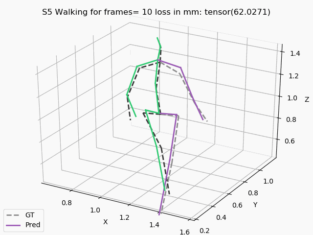

# AML_3D_Human_Pose_Forecasting
Advanced Machine Learning Final Project

3D Human Pose Forecasting

Our aim is to create one unique model, 
capable of recognizing future human body poses, 
for different actions, subjects and time windows.

The project is authored by Theodoros Sofianos (@theodoriss) and Katsiaryna Zavadskaya (@zavadskayak7)
[@theodoriss](https://github.com/theodoriss)

For downloading data: https://github.com/facebookresearch/VideoPose3D/blob/master/DATASETS.md for Human3.6m 3D
